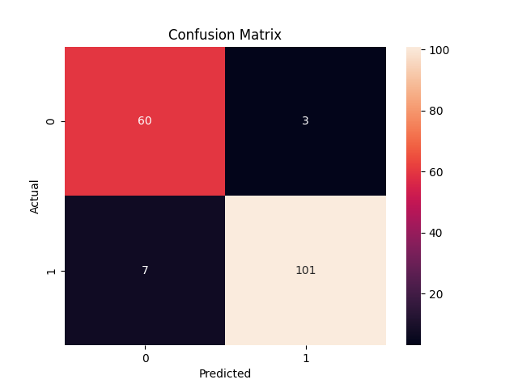

# Diabetes Readmission Analysis

## Overview
This project analyzes hospital readmission data using machine learning techniques to identify key factors influencing patient outcomes.

## Tools Used
- Python (Pandas, NumPy)
- Scikit-learn
- Matplotlib

## Tasks Performed
- Data cleaning and preprocessing
- Exploratory Data Analysis (EDA)
- Machine learning modeling (Decision Tree)
- Model evaluation using confusion matrix

## Results
The model was able to classify patient outcomes and identify important patterns in readmission behavior.

## Sample Output

## Author
Louisa Njikizana
